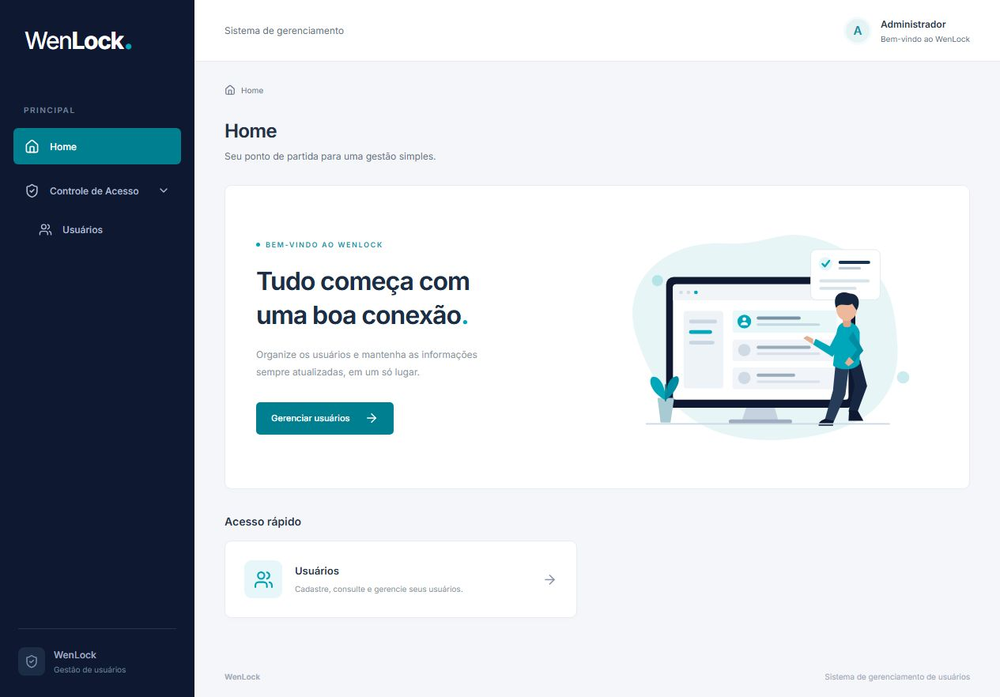

# WenLock • Gerenciamento de usuários

[](https://github.com/Falcon-Br/crud-conecthus/actions/workflows/ci.yml)

Aplicação full stack desenvolvida para o teste técnico da Conecthus: cadastro, consulta, pesquisa por nome, paginação, edição e exclusão de usuários. Interface baseada nas telas 11, 12, 13, 14 e 23 do protótipo WenLock.

**Stack:** React 19 + TypeScript + Vite, NestJS 11, TypeORM 0.3 e PostgreSQL 17.

Para avaliar rapidamente: consulte o [mapa de requisitos e critérios](docs/requirements.md), os [resultados dos testes](docs/verification.md) e o [design da solução](docs/design.md).



Veja também a [galeria com lista e formulário desktop/mobile](docs/screenshots/README.md) e a [revisão visual do protótipo](docs/visual-review.md).

## Executar com Docker

Pré-requisito: Docker Desktop iniciado, com Docker Compose v2. Na raiz do projeto:

```powershell
docker compose up -d --build --wait
```

Esse comando compila e inicia React servido pelo Nginx, API NestJS e PostgreSQL. Não é necessário instalar Node.js na máquina nem criar `.env` para essa opção. As migrations são aplicadas automaticamente antes de iniciar a API; o frontend aguarda a API e o banco ficarem saudáveis.

- Interface: http://localhost:8080
- Swagger UI: http://localhost:8080/api/docs
- OpenAPI JSON: http://localhost:8080/api/docs-json
- Saúde e conexão com o banco: http://localhost:8080/api/health

Para popular os dados fictícios, opcionalmente execute:

```powershell
docker compose exec api node dist/database/seed.js
```

O PostgreSQL mantém os dados no volume `wenlock_postgres_data`, inclusive após reconstruir imagens, reiniciar ou executar `docker compose down`. A opção `down -v` apaga esse volume e seus dados. A API usa o endereço interno `db:5432`; o banco também está acessível localmente na porta 54329 para desenvolvimento. As portas publicadas ficam restritas ao loopback da máquina.

```powershell
docker compose ps
docker compose logs -f api
docker compose stop
```

Para alterar portas, defina `WEB_PORT` (padrão 8080) e `DB_PORT` (padrão 54329) no `.env` ou no ambiente antes do `up`. Exemplo no PowerShell: `$env:WEB_PORT='8082'`. A API não publica uma porta diretamente; Nginx encaminha `/api` na mesma origem da interface.

## Desenvolver com recarga automática

Pré-requisitos: Node.js 22.12+ (validado com Node 24), npm e Docker Desktop iniciado. Portas utilizadas: 5173 (interface), 3000 (API), 54329 (PostgreSQL). No Windows, execute os comandos no PowerShell na raiz do projeto.

```powershell
npm ci
Copy-Item .env.example .env
npm run db:up
npm run db:migrate
npm run db:seed
npm run dev
```

No Linux/macOS, use `cp .env.example .env` no lugar de `Copy-Item`.

- Interface: http://localhost:5173
- Swagger UI: http://localhost:3000/api/docs
- OpenAPI JSON: http://localhost:3000/api/docs-json
- Saúde e conexão com o banco: http://localhost:3000/api/health

O seed cria 23 usuários fictícios para demonstrar paginação e é idempotente: não sobrescreve registros existentes. A senha fictícia desses registros é `Demo1!`. Não existe tela de login: o teste solicita o gerenciamento de usuários. Os serviços de desenvolvimento e o banco são vinculados ao loopback da máquina, sem publicação externa.

## Comandos

| Comando                   | Finalidade                                              |
| ------------------------- | ------------------------------------------------------- |
| `npm run dev`             | Iniciar API e frontend, com recarga                     |
| `npm run build`           | Compilar os dois projetos                               |
| `npm run typecheck`       | Verificar TypeScript                                    |
| `npm test`                | Testes unitários de regras e interface                  |
| `npm run test:api`        | Testes HTTP com PostgreSQL real isolado                 |
| `npm run test:e2e`        | Fluxos no Chromium com Playwright                       |
| `npm run test:e2e:docker` | Mesmos fluxos contra Compose isolado na porta 8081      |
| `npm run docker:up`       | Compilar e iniciar frontend, API e banco em contêineres |
| `npm run docker:seed`     | Popular dados fictícios pela API conteinerizada         |
| `npm run db:migrate`      | Aplicar migrations pendentes                            |
| `npm run db:seed`         | Popular dados fictícios sem sobrescrever                |
| `npm run format:check`    | Verificar formatação                                    |
| `docker compose stop`     | Parar os serviços, preservando o volume de demonstração |

Para testar integração e E2E, prepare o banco descartável separado, na porta 54330:

```powershell
docker compose --profile test up -d --wait db-test
npm run test:api
npx playwright install chromium
npm run test:e2e
```

Os testes de API limpam **somente** `wenlock_test` em `127.0.0.1:54330`. Não execute as suítes de API e E2E simultaneamente, pois compartilham esse banco descartável. O E2E inicia instâncias próprias da API e da interface nas portas 3001 e 5174. O banco de demonstração não é utilizado pelos testes.

Para verificar as imagens de produção com os mesmos testes de navegador, use um projeto Compose separado. Execute após `npm ci` e `npx playwright install chromium`. No PowerShell:

```powershell
$env:WEB_PORT='8081'
$env:DB_PORT='54331'
docker compose -p wenlock-container-test up -d --build --wait
npm run test:e2e:docker
docker compose -p wenlock-container-test down
Remove-Item Env:WEB_PORT, Env:DB_PORT
```

Esse projeto usa seu próprio banco e volume, separados da demonstração. No Linux/macOS, use `export WEB_PORT=8081 DB_PORT=54331` e `unset WEB_PORT DB_PORT` para definir e limpar as variáveis.

## Integração contínua

O [workflow CI](.github/workflows/ci.yml) executa em pushes, pull requests e acionamento manual:

1. **Qualidade e integração:** `npm ci`, formatação, TypeScript, 70 testes unitários, 20 testes HTTP com PostgreSQL 17 real e build dos dois projetos.
2. **Docker e navegador:** após a primeira etapa passar, compila e inicia as imagens em ambiente isolado e executa os 5 fluxos Playwright no Chromium. Guarda relatório, traces/screenshots de falhas e logs do Compose por 7 dias, depois encerra os contêineres do runner.

O token do workflow tem apenas permissão de leitura do conteúdo; não há deploy nem segredos externos necessários. O banco do CI usa dados descartáveis. Consulte o badge acima ou **Actions → CI** para acompanhar as execuções e baixar `docker-e2e-report`.

**Estado da entrega:** comandos verificados localmente. O resultado hospedado mais recente é apresentado pelo badge do workflow, sem substituir as evidências locais detalhadas.

## Estrutura e responsabilidades

```text
backend/src/
  users/       DTOs, controller, service, entidade e hash da senha
  database/    conexão, migration versionada e seed
  common/      validação HTTP e respostas de erro
frontend/src/
  components/  componentes de interface
  pages/       telas e seus fluxos
  lib/         validação e comunicação HTTP
e2e/           testes do fluxo completo
docs/          design, plano e evidências de verificação
```

O controller cuida do contrato HTTP; o service aplica as operações; o repository TypeORM faz persistência. A listagem usa uma transação de leitura consistente para que o total e os registros da página reflitam o mesmo estado do banco. A ordenação por nome e identificador é estável.

Migrations explícitas mantêm o schema reproduzível; `synchronize` está desativado. Restrições únicas no banco garantem email e matrícula únicos mesmo com requisições simultâneas. Não há cache nem infraestrutura distribuída, pois o domínio e o volume do teste não exigem isso.

Os Dockerfiles separam compilação e execução: o frontend final contém Nginx e arquivos estáticos; a API contém Node.js, código compilado e dependências de produção. Ambos executam com usuário sem privilégios e sistema de arquivos somente leitura, com `/tmp` temporário. O volume persistente pertence ao PostgreSQL. Healthchecks e dependências ordenam a inicialização; o entrypoint da API interrompe a execução se uma migration falhar.

## Regras e decisões

| Campo/fluxo | Comportamento                                                                                                                        |
| ----------- | ------------------------------------------------------------------------------------------------------------------------------------ |
| Nome        | Obrigatório, 1–30 caracteres; letras Unicode e espaços entre nomes. Normalização NFC, trim e redução de espaços repetidos.           |
| Email       | Obrigatório, formato válido, até 40 caracteres; trim, lowercase e unicidade.                                                         |
| Matrícula   | Texto com 4–10 dígitos, único, preservando zeros iniciais.                                                                           |
| Senha       | Exatamente 6 caracteres ASCII imprimíveis sem espaços; ao menos uma letra e um número. Símbolos permitidos.                          |
| Confirmação | Exigida na interface ao cadastrar ou informar uma nova senha. Não é persistida.                                                      |
| Edição      | A senha começa vazia; omitir ou enviar `""` mantém o hash existente. `null` é inválido.                                              |
| Busca       | Trecho literal do nome, case-insensitive; `%` e `_` não são curingas. Acentos são preservados: `João` e `Joao` são buscas distintas. |
| Paginação   | 15 itens por padrão, máximo 100; página fora do total é ajustada.                                                                    |
| Exclusão    | Confirmação com nome e atualização da página após sucesso.                                                                           |

As validações são executadas tanto na interface quanto na API. A validação de email usa o mesmo `validator.js` nos dois lados, incluindo endereços Unicode e local parts entre aspas. No frontend, o botão de envio fica desabilitado para formulário inválido, envio pendente e edição sem mudanças. A API rejeita propriedades desconhecidas e alterações vazias.

**Interpretações acordadas:** o XD diz “mín. 4 letras” para matrícula, enquanto o PDF pede números; adotamos 4–10 dígitos. Os limites de nome/email vêm do XD. Caracteres especiais na senha e manutenção da senha na edição foram aprovados como ajustes ao enunciado. A senha de seis caracteres atende ao exercício; uma aplicação pública precisaria de uma política de senha própria, autenticação e autorização antes de disponibilizar este CRUD.

Senhas são armazenadas com `scrypt`, salt aleatório individual e parâmetros registrados no hash. Nem senha nem hash são retornados pela API. DTOs de resposta selecionam explicitamente os campos públicos; erros de banco não expõem SQL, dados enviados ou detalhes internos.

## Contrato REST

Prefixo `/api`. A documentação interativa contém schemas, exemplos e códigos de resposta.

| Método e rota                               | Resposta                                      |
| ------------------------------------------- | --------------------------------------------- |
| `POST /users`                               | `201` com usuário criado                      |
| `GET /users?search=João&page=1&pageSize=15` | `200` com `data` e `meta`                     |
| `GET /users/:id`                            | `200` com usuário                             |
| `PATCH /users/:id`                          | `200` com usuário atualizado; campos parciais |
| `DELETE /users/:id`                         | `204`, sem corpo                              |

Usuário público: `id`, `name`, `email`, `registration`, `createdAt`, `updatedAt`.

```json
{
  "data": [],
  "meta": { "page": 1, "pageSize": 15, "total": 0, "totalPages": 0 }
}
```

Erros seguem `{ statusCode, code, message, errors? }`; `errors` associa campos a listas de mensagens. `400`: dados/JSON inválidos; `404`: usuário inexistente; `409`: email/matrícula duplicado; `413`: corpo JSON acima de 16 KB; `500`: erro interno sem detalhes sensíveis.

## Referências

- [Protótipo fornecido](https://xd.adobe.com/view/6c0ff585-36dd-4969-9d1f-b7661d820524-395c/screen/dcaf27a6-3e8a-4260-a8b0-7ff1f48142db/)
- [Integração NestJS e TypeORM](https://docs.nestjs.com/techniques/database)
- [Validação no NestJS](https://docs.nestjs.com/techniques/validation)
- [Checkout no GitHub Actions](https://github.com/actions/checkout)
- [Configuração de Node.js no Actions](https://github.com/actions/setup-node)
- [Playwright em CI](https://playwright.dev/docs/ci-intro)

## Solução de problemas

- **Docker indisponível:** abra o Docker Desktop, aguarde o engine e repita `docker compose up -d --build --wait`.
- **Falha ao iniciar a API no Docker:** consulte `docker compose logs api`; as migrations são automáticas. No desenvolvimento nativo, aplique `npm run db:migrate` antes da API ou do seed.
- **Conexão recusada:** confira `docker compose ps` e as portas. No desenvolvimento nativo, confira também `DATABASE_URL` no `.env`.
- **Porta em uso:** no Docker, ajuste `WEB_PORT`/`DB_PORT`. No desenvolvimento nativo, ajuste `PORT` e `API_TARGET` (proxy do Vite) de forma consistente.
- **Execução sem Docker:** use uma instância PostgreSQL 17 local e atualize `DATABASE_URL`; aplique as mesmas migrations.
