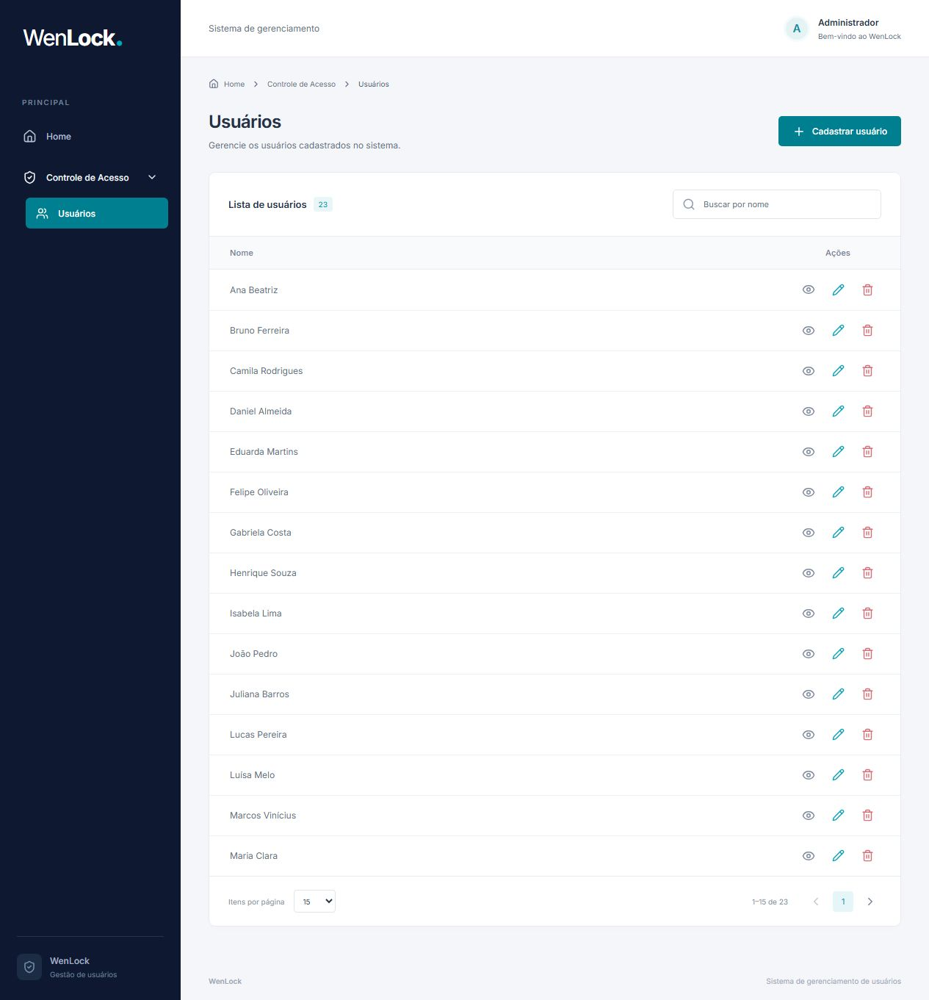
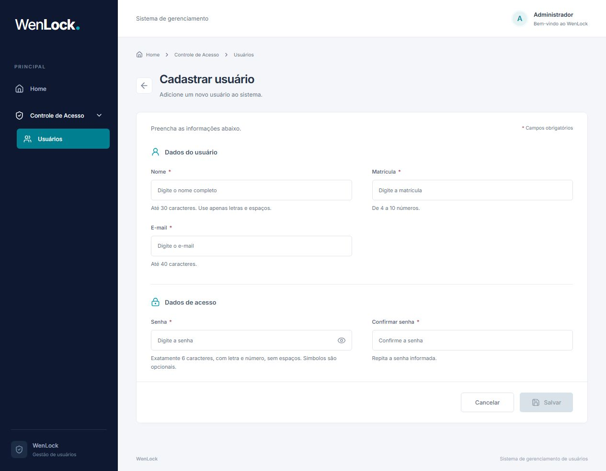
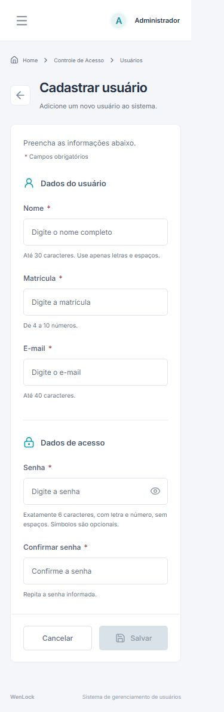

# Galeria da aplicação

Capturas reais da aplicação em Docker, em 3 de setembro de 2026. A lista contém apenas os 23 usuários fictícios do seed. As imagens não são mockups e não incluem senhas.

## Home

## Usuários

## Cadastro no desktop

## Cadastro no celular

Viewport de 390 × 844; captura da página completa, incluindo conteúdo acessível por rolagem.

As capturas desktop usam o viewport padrão do navegador (1280 × 720), com página completa quando necessário. Os PNGs excluem a barra de rolagem vertical, resultando em larguras úteis de 1265 pixels no desktop e 375 no celular. Para reproduzir: inicie o Compose, aplique o seed opcional, abra `/`, `/users` e `/users/new`; aguarde o carregamento e capture a página. No celular, ajuste para 390 × 844 antes de capturar. Refaça as imagens após mudanças de layout.
